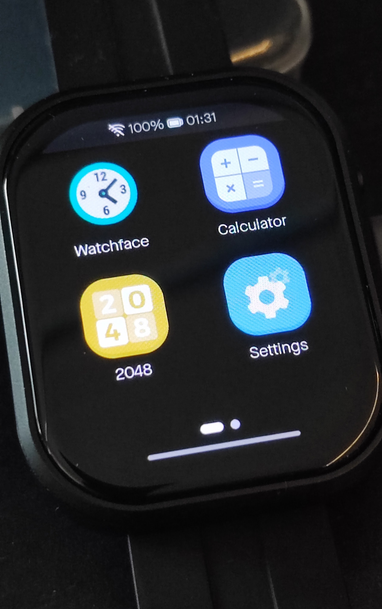

# Smartwatch firmware for Waveshare ESP32-S3-Touch-AMOLED-2.06

This repository contains the firmware for the Waveshare ESP32-S3-Touch-AMOLED-2.06 smartwatch development board.
More information about the board can be found on the Waveshare Wiki: [ESP32-S3-Touch-AMOLED-2.06 Wiki](https://www.waveshare.com/wiki/ESP32-S3-Touch-AMOLED-2.06)

## Introduction
ESP32-S3-Touch-AMOLED-2.06 is a high-performance, wearable watch-shaped development board launched by Waveshare. The product is based on the ESP32-S3R8 microcontroller, integrating a 2.06inch capacitive touch HD AMOLED screen, a six-axis sensor, RTC, an audio codec chip and power management and other functional modules. With a custom case, it looks and forms like a smart watch and is designed for prototyping and functional verification of wearable applications.

## Features
Equipped with ESP32-S3R8 high-performance Xtensa 32-bit LX7 dual-core processor, up to 240MHz main frequency
Supports 2.4GHz Wi-Fi (802.11 b/g/n) and Bluetooth 5 (BLE), with onboard antenna
Built in 512KB SRAM and 384KB ROM, with onboard 8MB PSRAM and an external 32MB Flash
Adopts Type-C interface to improve user convenience and device compatibility

## Hardware Description
Onboard 2.06inch high-definition capacitive touch AMOLED screen with a resolution of 410×502, 16.7M colors for clear color pictures
Embedded with CO5300 driver chip and FT3168 capacitive touch chip, communicating through QSPI and I2C interfaces respectively, minimizes required IO pins
Onboard QMI8658 6-axis IMU (3-axis accelerometer and 3-axis gyroscope) for detecting motion gesture, step counting, etc.
Onboard PCF85063 RTC chip connected to the battery via the AXP2101 for uninterrupted power supply
Onboard PWR and BOOT two side buttons with customizable functions, allowing for custom function development
Onboard 3.7V MX1.25 lithium battery recharge/discharge header
Bring out 1 x I2C port, 1 x UART port, and 1 x USB pad, which can be used for external device connection and debugging
Onboard TF card slot for extended storage and fast data transfer, flexible for data recording and media playback, simplifying circuit design
The benefits of using AXP2101 include efficient power management, support for multiple output voltages, charging and battery management functions, and optimization for battery life
The AMOLED screen has the advantages of higher contrast, wider viewing angle, richer colors, faster response, thinner design, lower power consumption, and flexibility

## Requirements
- ESP-IDF v5.x (recommended)
- Python 3.10+
- ESP-Brookesia

## Getting Started
1. Install ESP‑IDF and export environment (see Espressif docs):
   - Windows: run `export.bat` from your ESP‑IDF install
   - Linux/macOS: `. $IDF_PATH/export.sh`
2. Set the target and configure:
   - `idf.py set-target esp32s3`
   - `idf.py menuconfig` (optional)
3. Build, flash, and monitor:
   - `idf.py build`
   - `idf.py -p <PORT> flash`
   - `idf.py -p <PORT> monitor`

Replace `<PORT>` with your serial port (e.g., `COM5` on Windows or `/dev/ttyACM0` on Linux).

## Acknowledgements
- Built with ESP‑IDF and LVGL; thanks to their communities.
